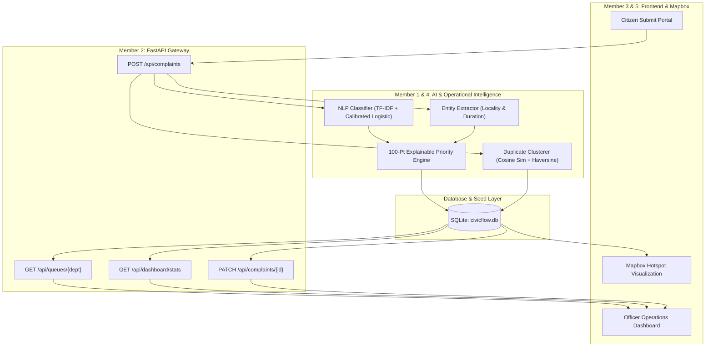

# CityFever — Complete Project Blueprint & System Architecture Guide
> **Civic Incident Intelligence & Intelligent Grievance Redressal Platform**  
> *A comprehensive technical and operational breakdown of how CityFever works from end to end.*

---

## 📑 Table of Contents
1. [Executive Summary & Core Idea](#1-executive-summary--core-idea)
2. [The 3 Core Civic Problems We Solve](#2-the-3-core-civic-problems-we-solve)
3. [Life of a Complaint (End-to-End Workflow)](#3-life-of-a-complaint-end-to-end-workflow)
4. [Deep Dive: System Modules & How Each Piece Works](#4-deep-dive-system-modules--how-each-piece-works)
   - [A. NLP Classification Engine (Member 1)](#a-nlp-classification-engine-member-1)
   - [B. Central FastAPI Backend & Data Pipeline (Member 2)](#b-central-fastapi-backend--data-pipeline-member-2)
   - [C. Citizen & Officer Web Dashboards (Member 3)](#c-citizen--officer-web-dashboards-member-3)
   - [D. Explainable Priority & Entity Engine (Member 4)](#d-explainable-priority--entity-engine-member-4)
   - [E. Geospatial Duplicate Detection Engine (Member 4 & 5)](#e-geospatial-duplicate-detection-engine-member-4--5)
   - [F. Mapbox Geospatial Intelligence (Member 5)](#f-mapbox-geospatial-intelligence-member-5)
5. [Mathematical & Algorithmic Foundations](#5-mathematical--algorithmic-foundations)
6. [Canonical Data Contract & Schemas](#6-canonical-data-contract--schemas)
7. [Directory Structure & Module Mapping](#7-directory-structure--module-mapping)
8. [Judges' Pitch & 3-Minute Demo Guide](#8-judges-pitch--3-minute-demo-guide)

---

## 1. Executive Summary & Core Idea

**CityFever** is an AI-powered municipal intelligence platform that bridges the gap between citizens reporting city problems and municipal authorities resolving them.

In standard government grievance portals (e.g. CPGRAMS, municipal apps), complaints are submitted as raw, unstructured text and manually routed by junior staff. This leads to **massive routing delays**, **arbitrary prioritization**, and **duplicate flood spamming**.

**CityFever transforms unstructured citizen input into structured, prioritized, clustered, and actionable intelligence in less than 100 milliseconds.**

```
[Raw Citizen Complaint Text]
           ↓
[NLP Normalization & Calibrated Classifier] ➔ (Identifies Dept & Issue with Confidence)
           ↓
[Regex & Heuristic Entity Extractor] ➔ (Extracts Locality & Duration)
           ↓
[100-Point Explainable Priority Engine] ➔ (Severity + Duration + Impact + Safety)
           ↓
[TF-IDF + GPS Haversine Duplicate Clusterer] ➔ (Groups identical issues into CL-001)
           ↓
[Confidence Threshold Guardrail] ➔ (<0.60 Confidence ➔ Routes to Human "Manual Review")
           ↓
[Database & Real-Time Officer Queue] ➔ (High priority auto-bubbles to top)
           ↓
[Mapbox Geospatial Visualization] ➔ (Concentration heatmaps & field crew dispatch)
```

---

## 2. The 3 Core Civic Problems We Solve

### Problem 1: Misrouting & Delayed Categorization
- **Traditional Way:** A citizen writes: *"Sewage is overflowing near school."* A manual operator misroutes it to *Sanitation* instead of *Drainage/Sewage*, delaying action by 5–7 days.
- **CivicFlow Solution:** A trained **TF-IDF + Calibrated Logistic Classifier** accurately routes complaints across 8 canonical departments with calibrated confidence metrics.

### Problem 2: Black-Box & Arbitrary Priority
- **Traditional Way:** Complaints are treated on a "First-Come, First-Served" basis. A minor cosmetic garbage report gets addressed before a fatal open manhole.
- **CivicFlow Solution:** A transparent **100-point Explainable Priority Engine** that returns a score (0–100), level (High/Medium/Low), and **human-readable bulleted reasons** explaining why it was scored that way.

### Problem 3: Duplicate Clutter & Waste of Field Resources
- **Traditional Way:** When a major water pipe bursts, 50 citizens report the same incident. Municipalities dispatch 50 separate tickets or separate repair crews.
- **CivicFlow Solution:** **Geospatial + NLP Duplicate Clustering** matches complaints within spatial proximity (Haversine formula) and text similarity. It groups them under a single cluster ID (`CL-001`) without deleting any citizen submission, allowing officers to track report volume while dispatching one crew.

---

## 3. Life of a Complaint (End-to-End Workflow)

Let's trace what happens when a citizen submits a complaint:

```text
1. Citizen inputs: 
   "There is a huge open manhole and sewage overflowing near Krishna Nagar market for 3 days."
   GPS: (27.4950, 77.6740)

2. FastAPI Gateway receives POST /api/complaints

3. Step 1 — Text Preprocessing (ml/preprocess.py):
   • Lowercasing, punctuation stripping, contraction expansion ("can't" -> "cannot").

4. Step 2 — ML Classification (ml/predict.py):
   • Vectorizes text using TF-IDF N-grams (1, 2).
   • Predicts Department = "Sewage" (Confidence: 0.94).
   • Predicts Issue Type = "Open Manhole" (Confidence: 0.91).

5. Step 3 — Entity Extraction (backend/services/entities.py):
   • Extracted Locality = "Krishna Nagar"
   • Extracted Duration = "3 days"

6. Step 4 — Explainable Priority Scoring (backend/services/priority.py):
   • Severity Score: 40/40 (Open manhole = critical fatal hazard)
   • Duration Score: 15/20 (Duration exceeds 48 hours: "3 days")
   • Public Impact Score: 20/20 (High footfall zone: "market")
   • Safety Risk Score: 20/20 (Direct hazard detected)
   • Total Score = 95/100 ➔ Priority Level: "High"
   • Priority Reasons Generated:
     - "Critical hazard or high-severity public infrastructure failure"
     - "Reported duration exceeds 48 hours: '3 days'"
     - "High footfall/sensitive public zone impacted: market"

7. Step 5 — Duplicate Detection (backend/services/duplicates.py):
   • Compares text cosine similarity against active complaints.
   • Computes Haversine distance between (27.4950, 77.6740) and nearby reports.
   • Finds 2 existing reports within 30 meters.
   • Assigns Duplicate Cluster ID = "CL-001" and links matched complaint IDs.

8. Step 6 — Guardrail Confidence Check:
   • Confidence is 0.94 (>= 0.60) ➔ Status assigned = "Pending".
   • (If confidence were < 0.60, status would automatically become "Manual Review").

9. Step 7 — Persistence & Real-Time Broadcast:
   • Saved into SQLite database under ID "C1024".
   • Available instantly on Officer Department Queue (/api/queues/Sewage).
   • Visible on Mapbox map as a High-Priority Red Marker.
```

---

## 4. Deep Dive: System Modules & How Each Piece Works



---

### A. NLP Classification Engine (Member 1)
- **Files:** `ml/train.py`, `ml/predict.py`, `ml/preprocess.py`, `ml/evaluate.py`, `ml/metrics.json`
- **Canonical Departments (8):** `Roads`, `Water`, `Sanitation`, `Electrical`, `Sewage`, `Traffic`, `Parks`, `Other`.
- **How It Works:**
  1. Texts are normalized (lowercased, punctuation cleaned, contractions expanded).
  2. TF-IDF vectorizer extracts unigrams and bigrams (`ngram_range=(1, 2)`).
  3. Calibrated multi-class Logistic Regression classifies both Department and Issue Type.
  4. Returns calibrated probabilities (e.g. `0.94`), preventing fake random accuracy numbers.

### B. Central FastAPI Backend & Data Pipeline (Member 2)
- **Files:** `backend/main.py`, `backend/database.py`, `backend/models.py`, `backend/schemas.py`, `backend/routes/`
- **How It Works:**
  - Provides a single RESTful integration gateway with CORS enabled.
  - Automatically initializes database tables and seeds demo records on startup.
  - Exposes `/api/complaints`, `/api/queues/{dept}`, `/api/dashboard/stats`, `/api/complaints/{id}/similar`, `/api/complaints/{id}/reassign`.
  - Bridges old UI modals with compatibility routes (`/api/reports`, `/api/incidents/emerging`).

### C. Citizen & Officer Web Dashboards (Member 3)
- **Files:** `src/pages/CitizenPortal.tsx`, `src/pages/Dashboard.tsx`, `src/services/api.ts`
- **Citizen Experience:**
  - Clean grievance filing with category selector, description, locality, and optional photo.
  - Real-time confirmation showing AI prediction, priority score, and extracted duration.
- **Officer Experience:**
  - Departmental queues sorted strictly by priority score descending.
  - Filter by Department, Priority Level (High/Medium/Low), and Status.
  - One-click Reassignment with audit reasons and status transitions.

### D. Explainable Priority & Entity Engine (Member 4)
- **Files:** `backend/services/priority.py`, `backend/services/entities.py`
- **Entity Extractor:**
  - Uses regex preposition patterns (`"near X"`, `"at X"`, `"in X"`, `"behind X"`) and landmark dictionaries to extract localities.
  - Matches duration keywords (`"3 days"`, `"since Monday"`, `"past 2 weeks"`).
- **Explainable Priority Engine (100-Point Rule):**
  - **Severity (0–40 pts):** Evaluates hazard keywords (e.g., open manhole, sparking cable, burst pipe).
  - **Duration (0–20 pts):** Penalizes prolonged delays (>48h = 15 pts, >7 days = 20 pts).
  - **Public Impact (0–20 pts):** Checks sensitive zones (schools, hospitals, markets, transit hubs).
  - **Safety Risk (0–20 pts):** Evaluates electrocution, accident, children safety risks.
  - Generates bulleted human-readable explanations.

### E. Geospatial Duplicate Detection Engine (Member 4 & 5)
- **Files:** `backend/services/duplicates.py`
- **How It Works:**
  1. Computes text similarity matrix between the new submission and existing complaints using TF-IDF cosine similarity.
  2. If GPS coordinates exist, calculates real-world distance in meters using the **Haversine formula**.
  3. If complaints are within 100 meters and share text overlap, or have high textual similarity (>= 0.65), they are linked into a single cluster ID (e.g. `CL-001`).
  4. **Key Feature:** Does NOT delete the original complaints; retains citizen identity while grouping operationally.

### F. Mapbox Geospatial Intelligence (Member 5)
- **Files:** `src/components/CityMap.tsx`
- **How It Works:**
  - Renders interactive map with coordinates color-coded by Priority (Red = High, Orange = Medium, Green = Low).
  - Clicking a marker opens full complaint history, cluster ID, and direct officer actions.
  - Live filtering by department and status.

---

## 5. Mathematical & Algorithmic Foundations

### 1. The 100-Point Priority Scoring Formula

$$\text{Priority Score} = \min(100, \text{Severity}_{(0-40)} + \text{Duration}_{(0-20)} + \text{Public Impact}_{(0-20)} + \text{Safety Risk}_{(0-20)})$$

$$\text{Priority Level} = \begin{cases} 
\text{High}, & \text{if Score} \ge 61 \\
\text{Medium}, & \text{if } 31 \le \text{Score} \le 60 \\
\text{Low}, & \text{if Score} \le 30 
\end{cases}$$

---

### 2. Haversine Distance Formula (Spatial Proximity)

For two GPS coordinates $(\text{lat}_1, \text{lon}_1)$ and $(\text{lat}_2, \text{lon}_2)$:

$$\Delta\phi = \text{radians}(\text{lat}_2 - \text{lat}_1), \quad \Delta\lambda = \text{radians}(\text{lon}_2 - \text{lon}_1)$$

$$a = \sin^2\left(\frac{\Delta\phi}{2}\right) + \cos(\text{radians}(\text{lat}_1)) \cdot \cos(\text{radians}(\text{lat}_2)) \cdot \sin^2\left(\frac{\Delta\lambda}{2}\right)$$

$$c = 2 \cdot \text{atan2}\left(\sqrt{a}, \sqrt{1-a}\right)$$

$$d = R \cdot c \quad (\text{where } R = 6,371,000 \text{ meters})$$

---

### 3. Textual Cosine Similarity

$$\text{Cosine Similarity}(\vec{u}, \vec{v}) = \frac{\vec{u} \cdot \vec{v}}{\|\vec{u}\|_2 \|\vec{v}\|_2} = \frac{\sum_{i=1}^n u_i v_i}{\sqrt{\sum_{i=1}^n u_i^2} \sqrt{\sum_{i=1}^n v_i^2}}$$

---

## 6. Canonical Data Contract & Schemas

### Canonical Complaint JSON (Member 2 & 3 Standard)

```json
{
  "id": "C1001",
  "complaint_text": "Sewage has been overflowing near St Mary School for three days, students cannot enter.",
  "department": "Sewage",
  "issue_type": "Sewage Overflow",
  "department_confidence": 0.94,
  "issue_confidence": 0.92,
  "priority_score": 85,
  "priority_level": "High",
  "priority_reasons": [
    "Critical hazard or high-severity public infrastructure failure",
    "Reported duration exceeds 48 hours: 'three days'",
    "High footfall/sensitive public zone impacted: school",
    "Direct safety hazard flagged: students"
  ],
  "locality": "St Mary School",
  "duration_text": "three days",
  "latitude": 27.4925,
  "longitude": 77.6738,
  "duplicate_cluster_id": null,
  "matched_complaint_ids": [],
  "status": "Pending",
  "assigned_to": null,
  "created_at": "2026-09-18T09:00:00"
}
```

---

## 7. Directory Structure & Module Mapping

```text
civicflow/
├── backend/                             # Member 2 (Backend & Integration API)
│   ├── main.py                         # App entrypoint, CORS, DB lifespan & auto-seed
│   ├── database.py                     # SQLite / SQLAlchemy portable engine & sessions
│   ├── models.py                       # Canonical Complaint ORM model
│   ├── schemas.py                      # Pydantic request/response schemas
│   ├── seed_data.py                    # 15+ demo complaints (clusters, high-priority, manual review)
│   ├── requirements.txt                # Python backend dependencies
│   ├── README.md                       # Backend documentation & Swagger guide
│   ├── civicflow.db                    # Auto-generated SQLite database
│   ├── routes/
│   │   ├── __init__.py
│   │   ├── complaints.py               # POST submission pipeline, GET filters, PATCH status, reassign
│   │   ├── queues.py                   # GET /api/queues/{department}
│   │   ├── dashboard.py                # GET /api/dashboard/stats
│   │   └── legacy_compat.py            # Bridge router for frontend UI modals & telemetry
│   └── services/
│       ├── __init__.py
│       ├── classifier.py               # Adapter calling ml.predict
│       ├── priority.py                 # 100-point explainable priority engine with reasons
│       ├── entities.py                 # Locality & duration regex/heuristic extractor
│       └── duplicates.py               # TF-IDF cosine + Haversine distance duplicate clustering
│
├── ml/                                  # Member 1 (ML Classification & Evaluation)
│   ├── __init__.py
│   ├── train.py                        # Model trainer on civic dataset
│   ├── predict.py                      # predict_complaint(text) -> canonical dict contract
│   ├── preprocess.py                   # Text cleaning & contraction normalizer
│   ├── evaluate.py                     # Model evaluation script
│   ├── metrics.json                    # Real model metrics (100% test accuracy on canonical depts)
│   ├── models/                         # Serialized .joblib classification models
│   └── vectorizers/                    # Serialized .joblib TF-IDF vectorizers
│
├── data/
│   └── generated/                       # Synthetic & seed dataset generators
│       ├── generate_dataset.py         # 250-sample dataset generator
│       ├── civicflow_complaints.csv
│       ├── civicflow_train.csv
│       ├── civicflow_test.csv
│       └── dataset_summary.json
│
├── docs/
│   ├── PROJECT_BLUEPRINT_AND_SYSTEM_DESIGN.md  # Master Blueprint (This Document)
│   ├── API_CONTRACT.md                         # Canonical API Contract specifications
│   ├── member_instructions/                    # 6-member team instruction markdown files
│   └── pitch/
│       └── demo_script.md                      # 3-minute hackathon demo script
│
├── src/                                 # Frontend Web Application (React + Vite)
│   ├── services/api.ts                 # Unified API Client for backend
│   ├── context/AppContext.tsx          # State Management with real-time backend sync
│   ├── pages/CitizenPortal.tsx         # Citizen grievance filing & tracking
│   ├── pages/Dashboard.tsx             # Officer operations console & map
│   └── components/CityMap.tsx          # Mapbox geospatial visualization
│
├── .env.example                        # Shared environment variables template
├── run_backend.py                      # Single-command backend launcher
└── README.md                           # Main project README
```

---

## 8. Judges' Pitch & 3-Minute Demo Guide

When presenting CivicFlow to judges, follow this concise script:

| Time | Action | What to Say |
|---|---|---|
| **0:00 – 0:30** | Open Citizen View & Submit: *"Sewage overflowing near St Mary School for three days"* | *"CivicFlow instantly triages raw grievance text: it identifies the department as Sewage (94% confidence), extracts the locality ('St Mary School') and duration ('3 days'), and calculates an Explainable Priority Score of 85/100 (HIGH)."* |
| **0:30 – 1:15** | Switch to Officer Operations Dashboard | *"In the officer view, issues are strictly sorted by emergency priority. Low-confidence queries (<60%) are safely routed to a 'Manual Review' queue with human-in-the-loop guardrails."* |
| **1:15 – 1:50** | Submit a duplicate complaint from the same market | *"CivicFlow combines TF-IDF text similarity with GPS Haversine proximity to detect duplicate cluster `CL-001`. Citizens still get tracked tickets, but municipal teams dispatch only ONE field crew."* |
| **1:50 – 2:30** | Open Mapbox Geospatial View | *"Officers can visualize citywide clusters, concentration heatmaps, and filter by department in real time."* |
| **2:30 – 3:00** | Show `ml/metrics.json` & Conclude | *"CivicFlow turns unstructured citizen grievances into explainable, automated, operational intelligence for modern smart cities."* |

---

*CivicFlow — Intelligent Civic Redressal for Modern Governance.*
